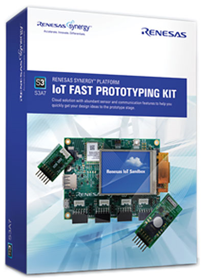

# Renesas-S3A7-IOT-Enabler

```
Synergy Configuration
  Board "S3A7_IOT_ENABLER"
  R7FS3A77C3A01CFB
    part_number: R7FS3A77C3A01CFB
    rom_size_bytes: 1048576
    ram_size_bytes: 196608
    data_flash_size_bytes: 16384
    package_style: LQFP
    package_pins: 144
    GT202 Wi-Fi 802.11n
  S3A7
    series: 3
```
